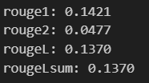
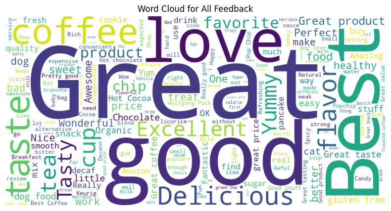
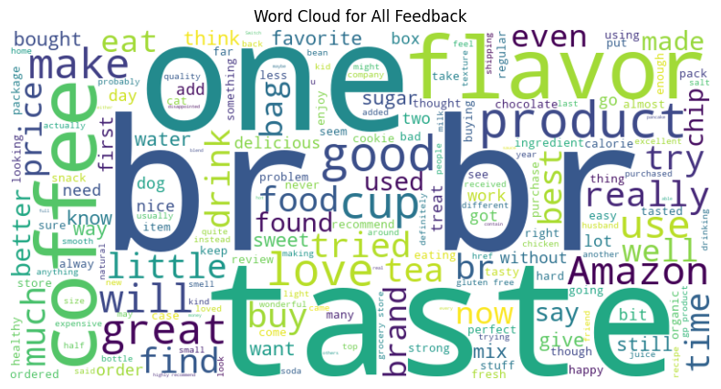

Live at:- https://huggingface.co/spaces/Shiva-gsk/Text-Summarizer-with-T5

## Problem Statement

Text Summarization on Product Reviews using Pretrained Transformer 

## Approach

Firstly, I searched Internet to get a good dataset Containing Product Reviews and summaries.
Then I explored Dataset using Kaggle and found various insights regarding data.
Next, I started to experiment summarization with existing pipeline using T5-small Transformer from Hugging-face and came to know that model's performance on the data set is not good (ROUGE ~= 0.08)
So, I started Experiments on Finetuining model on my Local Machine.
With only training it for few hours the ROUGE score increased. (ROUGE ~= 0.14) 
So, I confirmed an increase in model performance on finetuning and Did some training on dataset using Colab.
After training i tested it any test dataset and got a ROUGE score of 0.137 which is not so bad on t5-small. Results might be better using t5-large but a lot of computational power is required for that.
(I think start of art at the time of T5 is around 0.38)

## Results

On Final Training the model for about 2 hours, it achieved a ROUGE score of 0.1370

#### Word cloud Visualisations

Word-cloud on summaries

Word-cloud on review-text

We can see that Summaries contains more adjectives (e.g. great, good) and some product related words